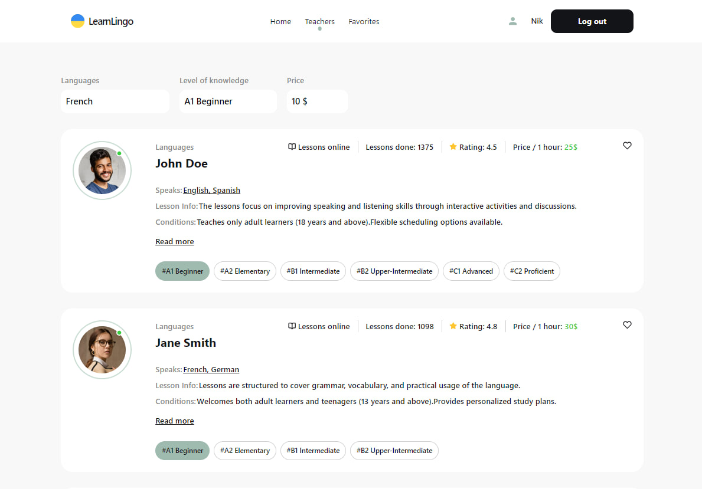

# LearnLingo Application

This project is a web application designed for users to explore and choose language teachers. Users can access a list of available filters for teachers and mark their favorites.

## Table of Contents
[LearnLingo](https://nikolas1790.github.io/learn-lingo/)
1. [Table of Contents](#table-of-contents)
2. [Features](#features)
3. [Technologies Used](#technologies-used)
4. [Technical task](#technical-task)

## Features
-  View a list availiable techers
-  Filter teachers on various criteria(Languages,Level of knowledge )
-  Mark teachers as favotires
-  Pagination for browsing throudh te teacher list

## Technologies Used
- **React.js**: Java Script library for user interfaces
- **Styled Components**: Styling library for React components
- **Firebase**: API for simulation dackend data

## Technical task

Create an application for a company offering to use the services of online language teachers. The application consists of 3 pages:
• a “Home” page with a list of company benefits and a link to start working with the application and redirects to the “Teachers” page. Stylization should be implemented using the examples given in the layout with different variations of the palette, or with the help of a prototype (which will make the "project" more unique).
• the "Teachers" page, which contains a list of teachers that the user can filter by the language of teaching, by the level of knowledge of the students with whom the teacher works and the price per hour of class.
• private page "Favorites" with teachers who were added by the user to "favorites"

Technical task
1. With the help of firebase_DB, add the possibility of authorization to the application (registration, login, obtaining data about the current user, logout).
2. The form for registration/authorization and minimal validation of its fields should be implemented using formik & yup. All fields are mandatory. The modal window with the form should be closed by clicking on the button in the form of a "cross", by clicking on the backdrop or pressing the Esc key.
3. In Realtime Database (by firebase), create a collection of teachers with the following fields: name, surname, languages, levels, rating, reviews, price_per_hour, lessons_done, avatar_url, lesson_info, conditions, experience.
4. According to the [layout](https://www.figma.com/file/dewf5jVviSTuWMMyU3d8Mc/%D0%9F%D0%B5%D1%82-%D0%BF%D1%80%D0%BE%D1%94%D0%BA%D1%82-%D0%B4%D0%BB%D1%8F-%D0%9A%D0%A6?type=design&node-id=0-1&mode=design&t=jCmjSs9PeOjObYSc-0), implement a card with a description of the teacher's characteristics.
5. 4 cards should be rendered on the "Teachers" page, and the rest of them can be loaded by clicking on the Load more button, after which a request to the database should be executed to display a new batch of cards.
6. In case of clicking on the button in the form of a "heart":
     UNAUTHORIZED USER - a modal window or push notification should appear stating that this functionality is available only to authorized users
     An authorized user - the card must be added to the list of favorites (using localStorage or by working with the users collection - by firebase), and the color of the "heart" button must be changed.
7. When the page is updated by an authorized user, the final result of the user's actions must be recorded. That is, if you add a card with information about the teacher to your favorites and refresh the page, the button still remains in the "favorite" state with the appropriate color.
8. In case of repeated clicking on the button in the form of a "heart", the card should be removed from the list of favorites, and the color of the button should change to its original state.
9. If you click on the Read more button, the card should open with more detailed information about the teacher and feedback from his students.
10. If you click on the Book trial lesson button, a modal window should open with a form for booking a trial lesson. The form and minimal validation of its fields must be implemented using formik & yup. All fields are mandatory.
11. The modal window should be closed by clicking on the button in the form of a "cross", by clicking on the backdrop or pressing the Esc key.
12. The private page "Favorites" is available to the authorized user, upon going to which the user has the opportunity to view all cards of teachers that he has added to his "favorites". In terms of styling, the page should be similar to the "Teachers" page.

Tasks with an asterisk*
Create routing using React Router.
Add filtering: by language of instruction; according to the level of knowledge of students with whom the teacher works; at the price per hour of class.

Performance criteria
● Layout from 320x to 1440x rubber, semantic and valid.
● No errors in the browser console.
● The work is done on native JS using a bundler (Vite, Parcel, etc.) or on React.
● User authorization and working with the collection are implemented using firebase
● Interactivity works according to the specification.
● The code is formatted and uncommented.
● The repository should have a README.md with a description of the project: what this project is about, the main technologies, layout, TK.
● The project is deployed on github pages, netlify.com or other third-party hosting

For any inquiries or assistance, please contact us at [ovsyannikovnikolai1790@gmail.com](ovsyannikovnikolai1790@gmail.com).

Thank you for choosing our LearnLingo Platform!